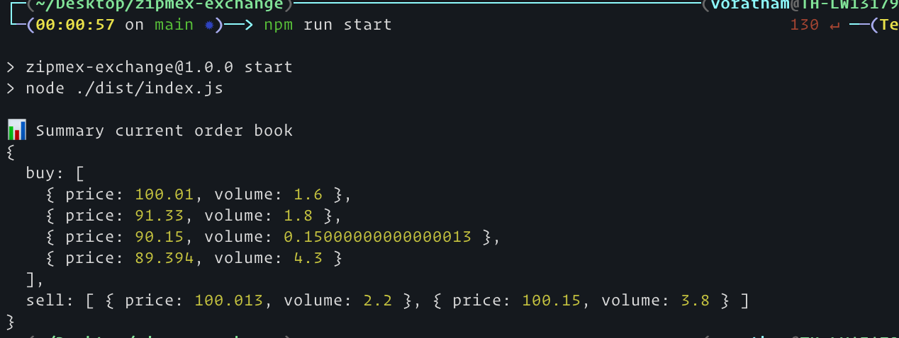

# Zipmex Exchange for Challenge

### How to start project

```sh
> npm ci or npm install
> npm run dev # start development mode
> npm run build && npm run start # start build mode
> npm run test # run for unit-test
> docker build -t test-zipmex -f ./Dockerfile .
> docker run test-zipmex
```

### Example Screenshot

